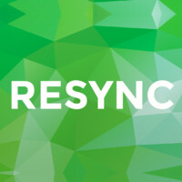

## Company 3
- *Role* | Mar'23 - Apr'23
- 
- Tags: Category 1
- Badges:
  - Badge [blue]
- List Items:
  - Point 1
  - Point 2

## Company 2
- *Role* | Feb'23 - Mar'23
- 
- Tags: Category 2
- Badges:
  - Badge [blue]
- List Items:
  - Point 1
  - Point 2

## JPMorgan Chase & Co 
- *Machine Learning Summer Analyst* | Jun'24 - Aug'24
- 
- Tags: Internship
- Badges:
  - Internship [blue]
- List Items:
  - Was part of the Compliance Technology Voice Surveillance Team
  - Enhanced voice surveillance by incorporating multilingual audio capabilities and improving accuracy for over 7 languages with Automatic Speech Recognition (ASR) models
  - Implemented speech-to-speech capabilities to significantly enhance the accuracy and functionality of the system for voice surveillance
  - Improved the accuracy of detecting exact locations of suspicious activities within multilingual audio files by 15% through the implementation of the Trie data structure and embedding matching techniques

## SGTraDex 
- *Software Engineer Intern* | Jan'24 - May'24
- 
- Tags: Internship
- Badges:
  - Internship [blue]
- List Items:
  - Developed Transferable Documents using OpenAttestation to track transactions, primarily utilizing Node.js for implementation.
  - Ensured code quality and maintainability by writing robust unit tests, enhancing code cleanliness and usability.
  - Developed a dynamic file upload feature on the frontend using React and a React drag-and-drop library, enhancing user experience and interface functionality.

## Disciplina Asset Management
- *Software Engineer Intern* | Aug'24 - Dec'24
- 
- Tags: Internship
- Badges:
  - Internship [blue]
- List Items:
  - Developed and implemented automation solutions for end-of-day reconciliations, optimizing processes to reduce task completion time by 4 hours weekly
  - Designed adaptable code structures to accommodate new use cases with minimal modifications, enabling non-technical personnel to use the software seamlessly
  - Independently researched and developed solutions to identify the most optimal, long-term, and use case-specific approaches

## GlobalFoundries
- *Data Engineer Intern* | May'23 - Aug'23
- 
- Tags: Internship
- Badges:
  - Internship [blue]
- List Items:
  - Architected and executed ETL pipelines utilizing a comprehensive range of AWS services such as S3 buckets, Lambda, SQS, Redshift, DynamoDB, EMR and Eventbridge, transforming raw sensor data into curated data
  - Effectively designed data ingestion pipelines with StreamSets, enabling the smooth migration of on-premise database data to the cloud, adapting datafiles to required formats like Parquet and XML, and implementing thorough data cleaning to ensure seamless compatibility with the chosen file structures
  - Engineered efficient SQL queries, incorporating intricate joins among sizable tables, with a focus on expediting data extraction while ensuring optimal performance
  - Contributed to the refactoring of the codebase, leveraging Python, PySpark, Numpy and Pandas for data processing, with a primary goal of enhancing code reusability across diverse use cases
  - Provided operational support by troubleshooting and resolving bugs in the mobile application using Microsoft PowerApps, ensuring seamless functionality and user experience
  - Developed automation bots utilizing Automation Anywhere A360, streamlining labor-intensive manual processes by automating tasks such as timely notification email dispatch

## Lexly
- *Software Engineer Intern* | Aug'22 - Dec'22
- 
- Tags: Internship
- Badges:
  - Internship [blue]
- List Items:
  - Developing and improving front-end interface using React.js with an expectation to cut time spent on finding healthcare experts by 40%
  - Creating APIs on the backend using C# and PostgresSQL
  - Communicated with back-end developers to ensure a smooth integration of front-end

## Resync
- *Software Engineer Intern* | Aug'22 - Dec'22
- 
- Tags: Internship
- Badges:
  - Internship [blue]
- List Items:
  - Involved in the refactoring of the front-end code of the smart building project and worked on a tight schedule with deployment required in 3 months
  - Redesigned the application to ensure consistency and an User Interface that was understandable and user-friendly for over 50 clients
  - Implemented multiple interactive components and pages and fetched data from the back-end in the front-end codebase using React.js, Next.js and Typescript
  - Conducted front-end testing using Cypress to ensure user stories are satisfied