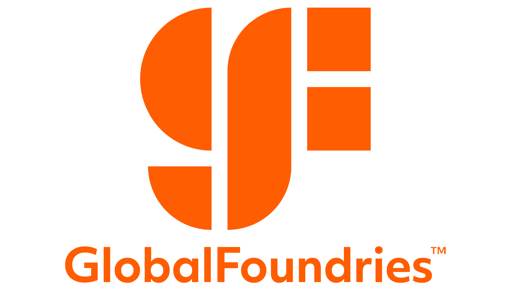

## Company 3
- *Role* | Mar'23 - Apr'23
- 
- Tags: Category 1
- Badges:
  - Badge [blue]
- List Items:
  - Point 1
  - Point 2

## Company 2
- *Role* | Feb'23 - Mar'23
- 
- Tags: Category 2
- Badges:
  - Badge [blue]
- List Items:
  - Point 1
  - Point 2

## GlobalFoundries
- *Data Engineer Intern* | May'23 - Aug'23
- 
- Tags: Internship
- Badges:
  - Internship [blue]
- List Items:
  - Involved in the creation and implementation of ETL (Extract, Transform, Load) pipelines which played a pivotal role in seamlessly converting raw sensor data into refined, curated data, leveraging the powerful suite of AWS services, including S3 buckets, Lambda functions, SQS queues, Redshift data warehousing, DynamoDB NoSQL databases, EMR big data processing, and Eventbridge event-driven architecture
  - Successfully engineered robust pipelines to facilitate the smooth transition of data from on-premise environments to the cloud, harnessing the capabilities of Streamsets for efficient data ingestion
  - Actively contributed to the development of automation bots for the RPA team, utilizing the cutting-edge capabilities of Automation Anywhere A360.

## Lexly
- *Software Engineer Intern* | Aug'22 - Dec'22
- 
- Tags: Internship
- Badges:
  - Internship [blue]
- List Items:
  - Developing and improving front-end interface using React.js with an expectation to cut time spent on finding healthcare experts by 40%
  - Creating APIs on the backend using C# and PostgresSQL
  - Communicated with back-end developers to ensure a smooth integration of front-end

## Resync
- *Software Engineer Intern* | Aug'22 - Dec'22
- 
- Tags: Internship
- Badges:
  - Internship [blue]
- List Items:
  - Involved in the refactoring of the front-end code of the smart building project and worked on a tight schedule with deployment required in 3 months
  - Redesigned the application to ensure consistency and an User Interface that was understandable and user-friendly for over 50 clients
  - Implemented multiple interactive components and pages and fetched data from the back-end in the front-end codebase using React.js, Next.js and Typescript
  - Conducted front-end testing using Cypress to ensure user stories are satisfied